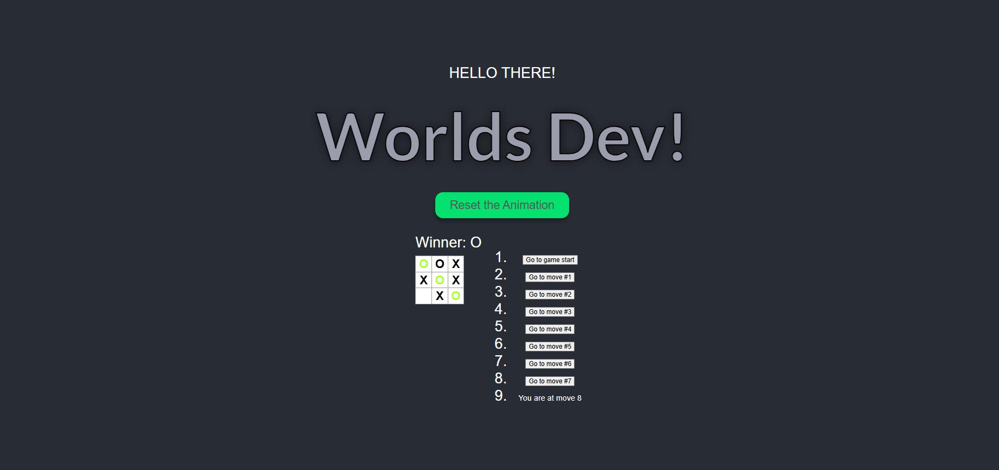

# 🎮 Tic-Tac-Toe Game with React

**Interactive Tic-Tac-Toe game built with React featuring move history and time travel functionality.**

---

## 📋 Project Summary

This learning project demonstrates core React concepts including component composition, state management with hooks, and unidirectional data flow. Built as part of a Udemy course (curso-udemy), the game provides hands-on experience with interactive UI components, game logic implementation, and advanced state handling techniques.

**Key Learning Objective**: Master React fundamentals through building a fully functional game with complex state management and event handling.

---

## 🎯 Project Overview

This is a classic Tic-Tac-Toe game where two players alternate turns on a 3×3 grid. The application highlights winning combinations with visual indicators and allows players to navigate through move history, effectively implementing a "time travel" feature to review or restart from previous game states.

**User Experience**: 
- Click any square to mark it with X or O
- Winner is automatically detected and highlighted
- View complete move history in the left sidebar
- Jump to any previous move to continue play
- Draw detection when all squares are filled

---

## ✨ Key Features

- ✅ **Interactive Game Board** – Click to place X or O marks
- ✅ **Winner Detection** – Automatic detection with visual highlighting of winning combination
- ✅ **Move History** – Complete log of all moves made during gameplay
- ✅ **Time Travel** – Jump to any previous move and continue playing from that state
- ✅ **Draw Detection** – Recognizes when the board is full with no winner
- ✅ **Current Move Indicator** – Shows which move is currently active
- ✅ **Responsive UI** – CSS-styled components for clear visual hierarchy

---

## 👁️ Preview



**Demo URL**: [Github Pages URL](https://abrahamsanchezdev.github.io/curso-udemy/), or see "Build & Run Locally" section below.

---

## 📁 Project Structure

```
src/
├── Components/
│   ├── Board.jsx              # Main game board logic and rendering
│   ├── Square.jsx             # Individual square component
│   ├── Game.jsx               # Game state and move history manager
│   ├── calculateWinner.jsx    # Winner detection utility
│   ├── FirstComponent.jsx     # Learning component
│   └── TextStrokeAnimation.jsx# Animated text header
├── App.jsx                    # Root application component
├── App.css                    # Application styling
├── proxy.js                   # Express proxy server
└── proxyDB.js                 # Proxy database configuration
```

**Key Systems**:
- **Game State Manager** (`Game.jsx`) – Manages move history and current board state using React hooks
- **Board Logic** (`Board.jsx`) – Handles click events, win/draw detection, and board rendering
- **Utility Functions** (`calculateWinner.jsx`) – Pure functions for deterministic win condition checking
- **UI Components** (`Square.jsx`, animations) – Presentational components for rendering

---

## 🏗️ Architecture Highlights

**Component Composition Pattern**: The Game component serves as the container managing all state, with Board and Square as presentational children. Data flows downward through props; events flow upward through callbacks.

**Immutable State Updates**: Move history is maintained using immutable patterns (`array.slice()`, spread operator) to enable reliable time travel without side effects.

**Pure Functions**: The `calculateWinner` function is deterministic and pure, receiving squares array and returning winning line indices or null.

**Event-Driven Interaction**: User clicks trigger event handlers that update state, which re-renders components efficiently through React's reconciliation algorithm.

---

## 🛠️ Technology Stack

- **React 18** – Modern component library with hooks for functional components and state management
- **React Hooks (useState)** – Manage game state, move history, and current move index
- **JavaScript ES6** – Arrow functions, destructuring, const/let for clean, modern syntax
- **Express** – Backend proxy server for development and API routing
- **Axios** – HTTP client for async requests (configured in proxy)
- **React Scripts (Create React App)** – Build tooling, hot reloading, and webpack configuration
- **CSS3** – Styling for grid layout, animations, and visual feedback

---

## 💻 Code Quality & Engineering Practices

**Architecture**: Follows React best practices with proper component hierarchy, single responsibility principle (each component has one job), and separation of concerns. Game state is centralized in the Game component, with Board handling logic and Square handling UI.

**Maintainability**: Pure utility functions (`calculateWinner`) are decoupled from components, making them testable and reusable. Component props clearly define interfaces; CSS classes are semantic and organized.

**Professional Standards**: Uses functional components with hooks (modern React), follows naming conventions (PascalCase for components, camelCase for functions), and implements proper key attributes in lists for rendering efficiency.

---

## 🚀 How to Build & Run Locally

### Prerequisites
- Node.js (v14+)
- npm or yarn

### Setup and Run

```bash
# Install dependencies
npm install

# Start the development server
npm start
```

The application will open at `http://localhost:3000` in your browser. Hot reloading is enabled—changes to source files will automatically refresh the page.

### Build for Production

```bash
# Create optimized production build
npm run build
```

The build output will be in the `build/` folder, ready for deployment to any static hosting service (Netlify, Vercel, GitHub Pages, etc.).

### Run Tests

```bash
# Launch test runner in watch mode
npm test
```

---

## 📚 Development Insights

This project is part of a Udemy course curriculum, serving as hands-on practice for React fundamentals. The implementation progresses through:

1. **Component Basics** – Building Square and Board as reusable UI components
2. **State Management** – Introducing useState and prop drilling for multi-level state
3. **Game Logic** – Implementing win conditions, draw detection, move validation
4. **Advanced Features** – Implementing move history navigation and time travel with immutable updates

The proxy server setup (`proxy.js`, `proxyDB.js`) demonstrates backend integration patterns commonly used in full-stack React applications.

---

## 🎓 Learning Outcomes

- ✅ Mastered React functional components and hooks-based state management
- ✅ Implemented complex game logic with efficient state transitions
- ✅ Practiced immutable state updates for reliable time travel features
- ✅ Built responsive, interactive UIs with event handling and conditional rendering
- ✅ Understood component composition and prop-driven architectures
- ✅ Learned CSS Grid and Flexbox for game board layout
- ✅ Configured and used Create React App tooling and development workflow

---

## 👨‍💻 Author & Contact

**Learning Project** – Udemy Course Practice Repository

---

**Note on Demo URL**: To generate a public demo URL, deploy the built application to a hosting service:
- **Vercel**: `npm install -g vercel && vercel` (requires Vercel account)
- **Netlify**: Drag-and-drop the `build/` folder to Netlify, or connect GitHub repo
- **GitHub Pages**: Configure in `package.json` with `"homepage"` field and run `npm run build && npm run deploy`
